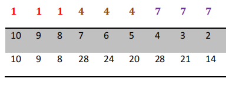

<h2 style="text-align: center" >Trabalho Pratico (Programação Paralela) - Cálculo de todos os CPF’s do Brasil</h2>

    

        O algoritmo de validação de CPF calcula o primeiro dígito verificador a partir dos 9 primeiros 
        dígitos do CPF, e em seguida, calcula o segundo dígito verificador a partir dos 9 primeiros dígitos do CPF, 
        mais o primeiro dígito, obtido na primeira parte.
    

    <h3>3.1 - Primeira etapa (PRIMEIRO digito verificador):</h3>
    

        A primeira etapa é calcular o primeiro dígito verificador, e para isso, separamos os primeiros 9 dígitos do 
        CPF (11144477735) e multiplicamos cada um dos números, da direita para a esquerda por números 
        crescentes a partir do número 2:
    

    
 
        
    

    

        Multiplicamos cada dígito do CPF pelo respectivo número e somamos cada um dos resultados:
        
10 + 9 + 8 + 28 + 24 + 20 + 28 + 21 + 14 = 162

        Pegamos o resultado obtido (162 pelo nosso exemplo) 162 e encontramos o resto da divisão desse 
        número por 11.
        
162/11 = quociente 14, resto 8

        Se o resto da divisão for menor que 2, então o dígito é igual a 0 (zero).
        Se o resto da divisão for maior ou igual a 2, então o dígito verificador é igual a 11 menos o resto da 
        divisão (11 - resto). Pelo nosso exemplo temos: 11 - 8 = 3.
        Logo o primeiro dígito verificador é 3. Então podemos pensar no CPF com os dois dígitos calculados 
        como sendo: 111444777-3X. Onde o X será calculado na próxima etapa do algoritmo.
    

    <h3>3.2 - Segunda etapa (SEGUNDO digito verificador X):</h3>
    

        Para calcular o segundo dígito verificador (X), vamos usar o primeiro dígito já calculado. Vamos montar a 
        mesma tabela de multiplicação usada no cálculo do primeiro dígito. Só que desta vez usaremos na 
        segunda linha os valores 11, 10, 9, 8, 7, 6, 5, 4, 3, 2 já que estamos incluindo mais um dígito no cálculo.
        
 
            
        

        

            Novamente, efetuamos o resultado da multiplicação e somamos todos os produtos obtidos.
            
11 + 10 + 9 + 32 + 28 + 24 + 35 + 28 + 21 + 6 = 204

            Dividimos o total do somatório por 11 e consideramos novamente o resto da divisão.
            
204/11 = quociente 18, resto 6

            Após obter o resto da divisão por 11, precisamos aplicar a mesma regra que utilizamos para obter o 
            primeiro dígito:
            Se o resto da divisão for menor que 2, então o dígito é igual a 0.
            Se o resto da divisão for maior ou igual a 2, então o dígito é igual a 11 menos o resto da divisão (11 -
            resto)
            
11 - 6 = 5, logo 5 é o nosso segundo dígito verificador

            Logo o nosso CPF fictício será igual a: 111.444.777-35
            Para avaliar a validade do CPF informado pelo usuário basta verificar se os dígitos verificadores gerados 
            pelo algoritmo condizem com os dígitos verificadores que o usuário informou junto ao CPF. No caso do 
            nosso exemplo o CPF informado é válido. (35 é igual a 35).
        

    

